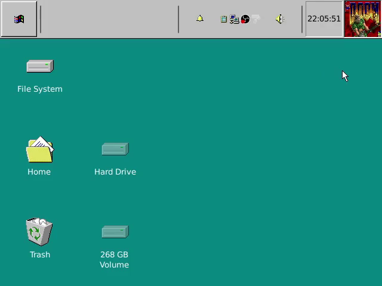
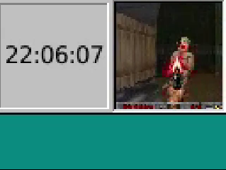

# DOOM-Xfce-panel

**DOOM in your taskbar!**




Source-port of [doomgeneric](https://github.com/ozkl/doomgeneric). Does not have sound.

You will need a WAD file (game data). If you don't own the game, the shareware version is freely available.

## Requirements

Ensure you are using the Xfce desktop environment.

The names listed below correspond to debian packages that must be installed with `apt`.

- `meson`
- `libgtk3-dev`
- `libxfce4panel-2.0-dev`
- `libxfce4ui-2-dev`
- `libxfce4util-dev`

## Building

Run the following commands:

```shell
meson setup --prefix=/usr builddir
sudo meson install -C builddir
```

Make sure to restart your panel instance afterwards: `xfce4-panel -r`. The plugin should appear as "DooM" in the panel's "Add items..." dialog.

## Playing

After selecting a `.WAD` file using the provided button, the game will start. The plugin has to be focused to accept keyboard input, which can be done by clicking on it.

The controls are based on the "Default controls" found [here](https://doom.fandom.com/wiki/Controls).

## Credits

A huge thank you goes out to:

- [Alexander Schwinn](https://gitlab.xfce.org/alexxcons) for creating the [xfce4-python-sample-plugin](https://gitlab.xfce.org/itsManjeet/xfce4-python-sample-plugin).
- [ozkl](https://github.com/ozkl) for creating [doomgeneric](https://github.com/ozkl/doomgeneric).
